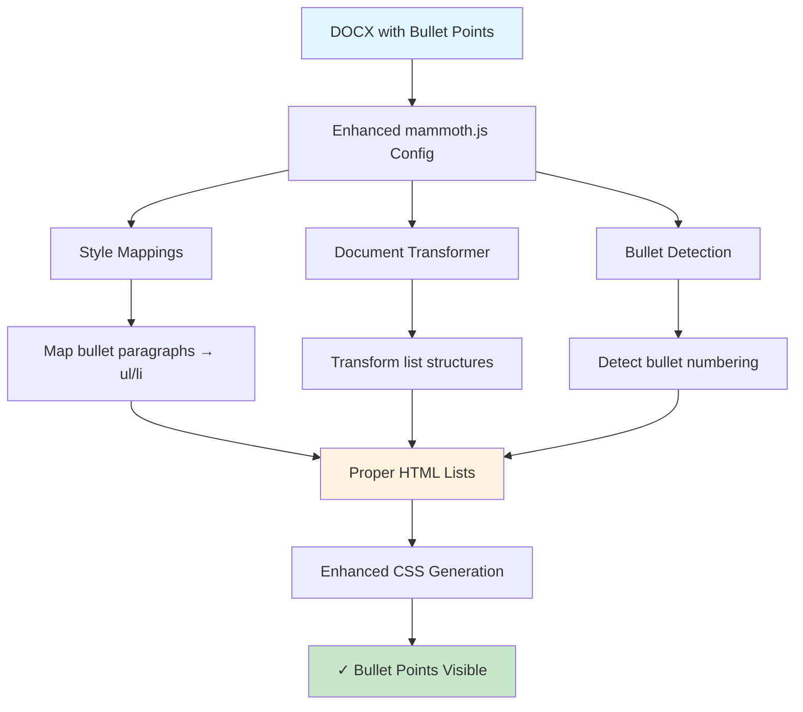

# Bullet Point Enhancement Plan for doc2web

**Document Version:** 1.0  
**Date:** June 2, 2025  
**Status:** Implementation Ready  
**Issue:** Simple bullet points (•) in DOCX are not appearing as bullets in HTML output

## Problem Analysis

### Root Cause
The issue stems from **mammoth.js configuration gaps** in the current implementation:

1. **Missing List Style Mappings**: [`lib/html/generators/style-mapping.js`](lib/html/generators/style-mapping.js) lacks mappings for list elements (`ul`, `ol`, `li`)
2. **Inactive Document Transformer**: The `createEnhancedDocumentTransformer` function returns elements unchanged
3. **Numbering vs. List Gap**: Sophisticated numbering support exists, but basic bullet point list handling is missing
4. **DOCX Introspection Disconnect**: Bullet formatting is parsed from DOCX XML but not applied to mammoth.js conversion

## Implementation Strategy



## Phase 1: Enhance Mammoth.js Configuration

### 1.1 Add List Style Mappings

**File:** [`lib/html/generators/style-mapping.js`](lib/html/generators/style-mapping.js)

**Current Code:**
```javascript
// Only basic text formatting mappings exist
styleMap.push("r[bold] => strong");
styleMap.push("r[italic] => em");
// Missing: List element mappings
```

**Enhancement:**
```javascript
/**
 * Add bullet point and list style mappings
 */
function addListStyleMappings(styleMap, styleInfo) {
  // Map common bullet point paragraph styles
  styleMap.push("p[style-name='List Paragraph'] => li.docx-list-item");
  styleMap.push("p[style-name='ListParagraph'] => li.docx-list-item");
  
  // Map bullet-specific styles
  Object.entries(styleInfo.styles?.paragraph || {}).forEach(([id, style]) => {
    if (style.numbering?.hasNumbering && style.numbering.format === 'bullet') {
      const safeClassName = id.toLowerCase().replace(/[^a-z0-9-_]/g, "-");
      styleMap.push(`p[style-name='${style.name}'] => li.docx-bullet-${safeClassName}`);
    }
  });
  
  // Handle numbered lists that contain bullets at sub-levels
  for (let level = 0; level <= 8; level++) {
    styleMap.push(`p[data-num-level='${level}'][data-format='bullet'] => li.docx-bullet-level-${level}`);
  }
}
```

### 1.2 Enhance Document Transformer

**Current Code:**
```javascript
function createEnhancedDocumentTransformer(styleInfo) {
  return function (element) {
    return element; // No transformation
  };
}
```

**Enhancement:**
```javascript
function createEnhancedDocumentTransformer(styleInfo) {
  return function (element) {
    // Transform bullet point paragraphs into list structures
    if (element.type === "paragraph") {
      const numberingInfo = getNumberingInfo(element, styleInfo);
      
      if (numberingInfo && numberingInfo.format === 'bullet') {
        // Convert paragraph to list item
        return {
          ...element,
          type: "listItem",
          listType: "unordered",
          level: numberingInfo.level || 0,
          bulletChar: numberingInfo.bulletChar || '•'
        };
      }
    }
    
    return element;
  };
}

function getNumberingInfo(element, styleInfo) {
  // Extract numbering information from element and styleInfo
  const styleName = element.styleName;
  if (!styleName) return null;
  
  // Check if this style has bullet numbering
  const paragraphStyle = findStyleByName(styleInfo.styles?.paragraph, styleName);
  if (paragraphStyle?.numbering?.format === 'bullet') {
    return {
      format: 'bullet',
      level: paragraphStyle.numbering.level,
      bulletChar: paragraphStyle.numbering.bulletChar || '•'
    };
  }
  
  return null;
}
```

## Phase 2: Improve DOCX Bullet Detection

### 2.1 Enhanced Bullet Recognition

**File:** [`lib/parsers/numbering-parser.js`](lib/parsers/numbering-parser.js)

**Current Code:**
```javascript
// Line 283: Basic bullet format mapping
bullet: "disc", // For CSS, 'disc' is a common bullet
```

**Enhancement:**
```javascript
/**
 * Enhanced bullet point detection and parsing
 */
function enhanceBulletDetection(levelDef, lvlTextNode) {
  if (levelDef.format === "bullet") {
    // Extract actual bullet character from lvlText
    const bulletText = lvlTextNode?.getAttribute("w:val") || "•";
    
    // Handle various bullet characters
    const bulletMap = {
      "": "•",           // Default bullet
      "·": "·",          // Middle dot
      "○": "○",          // White circle
      "■": "■",          // Black square
      "□": "□",          // White square
      "▪": "▪",          // Black small square
      "▫": "▫",          // White small square
      "►": "►",          // Right-pointing triangle
      "⇒": "⇒",          // Rightwards double arrow
    };
    
    levelDef.bulletChar = bulletMap[bulletText] || bulletText || "•";
    levelDef.isBullet = true;
    
    // Store original bullet character for CSS generation
    levelDef.originalBulletChar = bulletText;
  }
  
  return levelDef;
}
```

### 2.2 Style Integration Enhancement

**File:** [`lib/parsers/style-parser.js`](lib/parsers/style-parser.js)

**Enhancement:**
```javascript
/**
 * Integrate bullet information into style parsing
 */
function integrateBulletInfo(paragraphStyle, numberingDefs) {
  if (paragraphStyle.numbering?.hasNumbering) {
    const numId = paragraphStyle.numbering.id;
    const level = paragraphStyle.numbering.level;
    
    if (numberingDefs?.nums[numId]) {
      const abstractNumId = numberingDefs.nums[numId].abstractNumId;
      const abstractNum = numberingDefs.abstractNums[abstractNumId];
      
      if (abstractNum?.levels[level]?.format === 'bullet') {
        paragraphStyle.numbering.format = 'bullet';
        paragraphStyle.numbering.bulletChar = abstractNum.levels[level].bulletChar;
        paragraphStyle.isBulletList = true;
      }
    }
  }
  
  return paragraphStyle;
}
```

## Phase 3: CSS Generation for Bullets

### 3.1 Bullet List Styles

**File:** [`lib/css/generators/numbering-styles.js`](lib/css/generators/numbering-styles.js)

**Enhancement:**
```javascript
/**
 * Generate CSS for bullet lists
 */
function generateBulletListStyles(styleInfo) {
  let css = "\n/* Bullet List Styles */\n";
  
  // Base bullet list styling
  css += `
ul.docx-bullet-list {
  list-style-type: none;
  padding-left: 0;
  margin: 0;
}

li.docx-list-item,
li[class*="docx-bullet-"] {
  position: relative;
  padding-left: 20pt;
  margin-bottom: 0.5em;
  line-height: 1.4;
}

li.docx-list-item::before,
li[class*="docx-bullet-"]::before {
  content: "•";
  position: absolute;
  left: 0;
  top: 0;
  width: 15pt;
  text-align: left;
  font-weight: normal;
}
`;

  // Generate level-specific bullet styles
  for (let level = 0; level <= 8; level++) {
    const indent = level * 18; // 0.25 inch per level
    const bulletChar = getBulletCharForLevel(level);
    
    css += `
li.docx-bullet-level-${level} {
  margin-left: ${indent}pt;
}

li.docx-bullet-level-${level}::before {
  content: "${bulletChar}";
}
`;
  }
  
  return css;
}

function getBulletCharForLevel(level) {
  const bullets = ["•", "○", "■", "□", "▪", "▫", "►", "⇒"];
  return bullets[level % bullets.length];
}
```

### 3.2 Custom Bullet Character Support

**Enhancement:**
```javascript
/**
 * Generate CSS for custom bullet characters
 */
function generateCustomBulletStyles(numberingDefs) {
  let css = "";
  
  Object.entries(numberingDefs.abstractNums || {}).forEach(([id, abstractNum]) => {
    Object.entries(abstractNum.levels || {}).forEach(([level, levelDef]) => {
      if (levelDef.format === 'bullet' && levelDef.bulletChar) {
        css += `
li[data-abstract-num="${id}"][data-num-level="${level}"]::before {
  content: "${levelDef.bulletChar}";
  ${levelDef.runProps?.color ? `color: ${levelDef.runProps.color};` : ''}
  ${levelDef.runProps?.fontSize ? `font-size: ${levelDef.runProps.fontSize};` : ''}
  ${levelDef.runProps?.fontFamily ? `font-family: "${levelDef.runProps.fontFamily}";` : ''}
}
`;
      }
    });
  });
  
  return css;
}
```

## Phase 4: Post-Processing Fallback

### 4.1 Bullet List Post-Processor

**File:** [`lib/html/generators/html-processing.js`](lib/html/generators/html-processing.js)

**Enhancement:**
```javascript
/**
 * Post-process paragraphs that should be bullet lists
 */
function postProcessBulletLists(document, styleInfo) {
  // Find paragraphs that look like bullet points but weren't converted
  const bulletParagraphs = document.querySelectorAll('p[data-format="bullet"], p.docx-bullet-item');
  
  if (bulletParagraphs.length === 0) return;
  
  // Group consecutive bullet paragraphs into lists
  let currentList = null;
  let currentLevel = -1;
  
  bulletParagraphs.forEach(p => {
    const level = parseInt(p.getAttribute('data-num-level') || '0');
    
    if (level === 0 || !currentList) {
      // Create new list
      currentList = document.createElement('ul');
      currentList.className = 'docx-bullet-list';
      p.parentNode.insertBefore(currentList, p);
      currentLevel = level;
    }
    
    // Convert paragraph to list item
    const li = document.createElement('li');
    li.className = p.className.replace('docx-p-', 'docx-bullet-');
    li.innerHTML = p.innerHTML;
    
    // Copy data attributes
    Array.from(p.attributes).forEach(attr => {
      if (attr.name.startsWith('data-')) {
        li.setAttribute(attr.name, attr.value);
      }
    });
    
    currentList.appendChild(li);
    p.remove();
  });
}
```

## Phase 5: Testing Strategy

### 5.1 Test Cases

**Test Documents:**
1. **Simple Bullets**: Document with basic bullet points (•)
2. **Nested Bullets**: Multi-level bullet lists
3. **Mixed Lists**: Numbered lists with bullet sub-items
4. **Custom Bullets**: Documents with custom bullet symbols
5. **Complex Formatting**: Bullets with bold, italic, colors

**Expected Outcomes:**
```html
<!-- Simple bullet list -->
<ul class="docx-bullet-list">
  <li class="docx-bullet-level-0">First bullet point</li>
  <li class="docx-bullet-level-0">Second bullet point</li>
</ul>

<!-- Nested bullet list -->
<ul class="docx-bullet-list">
  <li class="docx-bullet-level-0">Main point
    <ul class="docx-bullet-list">
      <li class="docx-bullet-level-1">Sub point</li>
    </ul>
  </li>
</ul>
```

### 5.2 Regression Testing

**Areas to Verify:**
- Existing numbered lists remain functional
- TOC generation is unaffected
- Heading processing works correctly
- CSS generation doesn't conflict
- Performance impact is minimal

## Implementation Order

1. **Phase 1.1**: Add list style mappings to [`style-mapping.js`](lib/html/generators/style-mapping.js)
2. **Phase 2.1**: Enhance bullet detection in [`numbering-parser.js`](lib/parsers/numbering-parser.js)
3. **Phase 3.1**: Add bullet CSS generation to [`numbering-styles.js`](lib/css/generators/numbering-styles.js)
4. **Phase 1.2**: Implement document transformer enhancements
5. **Phase 4.1**: Add post-processing fallback
6. **Phase 5**: Comprehensive testing

## Success Criteria

✅ **Primary Goal**: Simple bullet points (•) from DOCX appear as proper bullets in HTML output  
✅ **Secondary Goals**:
- Nested bullet lists maintain proper hierarchy
- Custom bullet characters are preserved
- Bullet formatting (bold, italic, colors) is maintained
- No regression in existing numbered list functionality
- Performance impact < 5% increase in processing time

## Technical Notes

- **Mammoth.js Version**: Ensure compatibility with current mammoth.js version
- **CSS Specificity**: Use appropriate specificity to avoid conflicts with existing styles
- **Accessibility**: Ensure generated lists are screen reader friendly
- **Browser Compatibility**: Test bullet rendering across major browsers
- **Memory Usage**: Monitor memory impact of additional DOM processing

## Files Modified

1. [`lib/html/generators/style-mapping.js`](lib/html/generators/style-mapping.js) - Add list mappings and transformer
2. [`lib/parsers/numbering-parser.js`](lib/parsers/numbering-parser.js) - Enhance bullet detection
3. [`lib/css/generators/numbering-styles.js`](lib/css/generators/numbering-styles.js) - Add bullet CSS
4. [`lib/html/generators/html-processing.js`](lib/html/generators/html-processing.js) - Add post-processing
5. [`lib/parsers/style-parser.js`](lib/parsers/style-parser.js) - Integrate bullet info

This comprehensive plan addresses the root cause while maintaining the existing sophisticated numbering system and ensuring no regression in current functionality.
