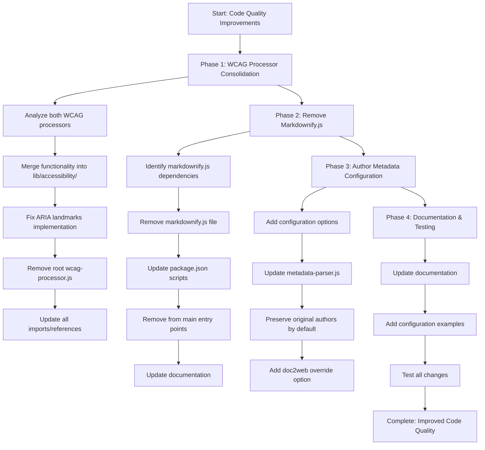

# Doc2Web Code Quality Improvements Plan

## Overview

This document outlines the implementation plan to address four key areas for improvement in the doc2web project, focusing on maintaining simplicity and performance while enhancing code quality and consistency.

## Areas for Improvement

### 1. WCAG Processor Discrepancy & ARIA Landmarks
- **Issue**: Two [`wcag-processor.js`](../wcag-processor.js) files exist (root and [`lib/accessibility/`](../lib/accessibility/wcag-processor.js))
- **Problem**: ARIA landmarks disabled in lib version due to "DOM manipulation errors"
- **Solution**: Consolidate into single working processor with fixed ARIA landmarks

### 2. CSS Specificity and !important Usage
- **Issue**: Extensive use of `!important` in CSS generators
- **Decision**: Keep all `!important` declarations as they serve critical override purposes
- **Action**: No changes required - maintain current approach

### 3. Markdown TOC Page Numbers
- **Issue**: [`markdownify.js`](../markdownify.js) includes page numbers while HTML output hides them
- **Solution**: Remove [`markdownify.js`](../markdownify.js) completely to eliminate inconsistencies

### 4. Author Metadata Hardcoding
- **Issue**: [`lib/parsers/metadata-parser.js`](../lib/parsers/metadata-parser.js) hardcodes author to "doc2web"
- **Solution**: Make author metadata configurable with original author preservation

## Implementation Strategy



## Phase 1: WCAG Processor Consolidation

### Objective
Consolidate the two [`wcag-processor.js`](../wcag-processor.js) files and restore ARIA landmarks functionality.

### Tasks

#### 1.1 Analyze Differences
- Compare root [`wcag-processor.js`](../wcag-processor.js) with [`lib/accessibility/wcag-processor.js`](../lib/accessibility/wcag-processor.js)
- Identify functional differences and improvements in each version
- Document which features to preserve from each file

#### 1.2 Merge Best Features
- Use the working [`addAriaLandmarks`](../wcag-processor.js:257) function from the root file
- Preserve enhanced error handling from the lib version
- Combine comprehensive accessibility features from both versions
- Ensure all functions are properly documented

#### 1.3 Fix ARIA Landmarks Implementation
- Implement the working ARIA landmarks logic from the root file
- Add proper error handling to prevent DOM manipulation errors
- Ensure landmarks are added without moving existing elements
- Test with various document structures

#### 1.4 Update References and Cleanup
- Search for all imports of the root [`wcag-processor.js`](../wcag-processor.js)
- Update imports to use [`lib/accessibility/wcag-processor.js`](../lib/accessibility/wcag-processor.js)
- Remove the redundant root file
- Verify no broken imports remain

### Files to Modify
- **Enhanced**: [`lib/accessibility/wcag-processor.js`](../lib/accessibility/wcag-processor.js) - Merge working ARIA landmarks
- **Removed**: [`wcag-processor.js`](../wcag-processor.js) (root file)
- **Updated**: Any files importing the root wcag-processor

### Success Criteria
- Single, consolidated WCAG processor in [`lib/accessibility/`](../lib/accessibility/)
- Working ARIA landmarks functionality
- No broken imports or references
- All accessibility features preserved and enhanced

## Phase 2: Remove Markdownify.js

### Objective
Completely remove [`markdownify.js`](../markdownify.js) to eliminate TOC page number inconsistencies and simplify the codebase.

### Tasks

#### 2.1 Identify Dependencies
- Search entire codebase for references to [`markdownify.js`](../markdownify.js)
- Identify all import statements and function calls
- Document any dependent functionality that needs alternative solutions

#### 2.2 Remove File and References
- Delete [`markdownify.js`](../markdownify.js) file
- Remove all import statements
- Remove function calls and related code
- Update error handling for removed functionality

#### 2.3 Update Configuration and Scripts
- Remove from [`package.json`](../package.json) scripts if present
- Remove from main application entry points
- Update [`doc2web.js`](../doc2web.js) or other main files
- Remove CLI options related to markdown output

#### 2.4 Update Documentation
- Remove markdown conversion references from user manual
- Update [`README.md`](../README.md) to reflect HTML-only output
- Update CLI help text and examples
- Remove markdown-related configuration options

### Files to Modify
- **Removed**: [`markdownify.js`](../markdownify.js)
- **Updated**: [`package.json`](../package.json) - Remove markdown-related scripts
- **Updated**: [`doc2web.js`](../doc2web.js) or main entry files - Remove markdownify imports/calls
- **Updated**: [`docs/user-manual.md`](../docs/user-manual.md) - Update documentation
- **Updated**: [`README.md`](../README.md) - Update feature descriptions

### Success Criteria
- [`markdownify.js`](../markdownify.js) completely removed
- No broken references or imports
- Documentation updated to reflect HTML-only output
- Simplified codebase with consistent output format

## Phase 3: Author Metadata Configuration

### Objective
Make author metadata handling configurable while preserving original document authors by default.

### Tasks

#### 3.1 Add Configuration Options
- Add `preserveOriginalAuthor` option (default: `true`)
- Add `overrideAuthor` option for custom author names
- Add `useDoc2webAuthor` option for "doc2web" branding
- Integrate with existing configuration system

#### 3.2 Update Metadata Parser
- Modify [`lib/parsers/metadata-parser.js`](../lib/parsers/metadata-parser.js) to respect configuration
- Preserve original [`metadata.core.creator`](../lib/parsers/metadata-parser.js:36) when configured
- Only override to "doc2web" when explicitly requested
- Update all metadata functions (Dublin Core, Open Graph, Twitter Card, JSON-LD)

#### 3.3 Configuration Integration
- Add options to main configuration object
- Update CLI argument parsing if applicable
- Ensure backward compatibility with existing configurations
- Add validation for configuration options

#### 3.4 Testing and Examples
- Test with various author configurations
- Create examples for different use cases
- Document configuration options thoroughly

### Files to Modify
- **Updated**: [`lib/parsers/metadata-parser.js`](../lib/parsers/metadata-parser.js) - Add configurable author handling
- **Updated**: Main configuration files - Add new options
- **Updated**: CLI files - Add command-line options if needed
- **Updated**: Documentation - Add configuration examples

### Configuration Options
```javascript
{
  metadata: {
    preserveOriginalAuthor: true,  // Default: preserve original document author
    overrideAuthor: null,          // Custom author name (overrides original)
    useDoc2webAuthor: false        // Use "doc2web" as author (legacy behavior)
  }
}
```

### Success Criteria
- Configurable author metadata handling
- Original authors preserved by default
- Backward compatibility maintained
- Clear documentation and examples

## Phase 4: Documentation & Testing

### Objective
Update documentation and ensure all changes work correctly.

### Tasks

#### 4.1 Update Technical Documentation
- Document the consolidated WCAG processor
- Remove markdownify references from architecture docs
- Document new author metadata options
- Update API documentation

#### 4.2 Update User Documentation
- Update [`docs/user-manual.md`](../docs/user-manual.md) with new features
- Remove markdown conversion instructions
- Add configuration examples for author metadata
- Update troubleshooting guides

#### 4.3 Add Configuration Examples
- Show how to preserve original authors
- Show how to override with custom author
- Show how to use "doc2web" as author (legacy mode)
- Provide real-world use case examples

#### 4.4 Comprehensive Testing
- Test ARIA landmarks functionality with various document types
- Test author metadata configurations
- Verify no broken imports after file removal
- Test overall conversion process end-to-end
- Performance testing to ensure no regressions

### Files to Modify
- **Updated**: [`docs/user-manual.md`](../docs/user-manual.md) - Update user documentation
- **Updated**: [`docs/architecture.md`](../docs/architecture.md) - Update technical documentation
- **Updated**: [`README.md`](../README.md) - Update feature descriptions and examples
- **Added**: Configuration examples and use cases

### Success Criteria
- Complete and accurate documentation
- Clear configuration examples
- All functionality tested and verified
- No regressions in performance or features

## Implementation Priority

### High Priority
1. **WCAG processor consolidation** - Critical for accessibility compliance
2. **Remove markdownify.js** - Eliminates inconsistencies and simplifies codebase

### Medium Priority
3. **Author metadata configuration** - Improves flexibility and user control
4. **Documentation updates** - Ensures usability and maintainability

## Risk Mitigation

### Backup Strategy
- Keep copies of original files until testing is complete
- Use version control branches for each phase
- Document rollback procedures

### Testing Strategy
- Test each phase independently before proceeding
- Maintain comprehensive test coverage
- Test with real-world documents

### Import Verification
- Use search tools to find all file references before removal
- Verify imports with static analysis tools
- Test in isolated environment first

### Backward Compatibility
- Ensure existing configurations continue to work
- Provide migration guides for breaking changes
- Maintain API compatibility where possible

## Expected Outcomes

### Code Quality Improvements
1. **Single Source of Truth**: One consolidated, working WCAG processor
2. **Simplified Codebase**: Removal of markdownify.js reduces complexity
3. **Improved Accessibility**: Working ARIA landmarks enhance WCAG compliance
4. **Flexible Metadata**: Configurable author handling meets various use cases
5. **Consistent Output**: HTML-only output eliminates format inconsistencies

### Performance Benefits
- Reduced bundle size from removed markdownify.js
- Simplified processing pipeline
- Fewer file dependencies

### Maintainability Benefits
- Single WCAG processor reduces maintenance overhead
- Clear configuration options improve user experience
- Better documentation reduces support burden

## Conclusion

This plan addresses all identified code quality issues while maintaining the project's focus on simplicity and performance. The phased approach allows for careful testing and validation at each step, ensuring that improvements don't introduce regressions.

The consolidation of WCAG processors and removal of markdownify.js will significantly simplify the codebase while improving accessibility compliance and output consistency. The configurable author metadata provides flexibility for different use cases while maintaining backward compatibility.

---

**Document Version**: 1.0  
**Created**: 2025-01-06  
**Author**: doc2web development team  
**Status**: ✅ COMPLETED - All phases implemented successfully
