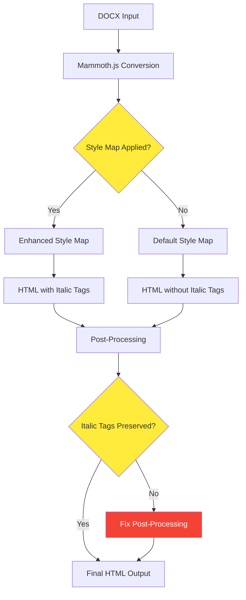

# Italic Formatting Fix Plan

**Document Version:** 1.0  
**Date:** June 2, 2025  
**Status:** Implementation Ready  
**Issue:** Italic characters from DOCX files are not being converted to HTML with proper italic formatting

## Problem Statement

The doc2web application is not preserving italic formatting when converting DOCX documents to HTML. Italic text in the source DOCX appears as regular text in the HTML output, with no italic styling applied.

## Root Cause Analysis

Based on code analysis, the issue appears to be in the mammoth.js configuration where `includeDefaultStyleMap: false` may be preventing basic formatting like italics from being converted, despite having proper style mappings in place.

### Current State Analysis

1. **Style parsing correctly extracts italic formatting** - [`lib/parsers/style-parser.js:535-536`](lib/parsers/style-parser.js) properly detects `w:i` nodes and sets `props.italic = true`

2. **Style mapping includes italic conversion** - [`lib/html/generators/style-mapping.js:133`](lib/html/generators/style-mapping.js) has `styleMap.push("r[italic] => em");`

3. **CSS generation supports italic styles** - [`lib/css/generators/character-styles.js:24`](lib/css/generators/character-styles.js) includes `${style.italic ? "font-style: italic;" : ""}`

4. **The issue likely occurs in mammoth.js configuration or post-processing** - The style mappings may not be properly applied or the `includeDefaultStyleMap: false` setting might be interfering with basic formatting.

## Implementation Plan

### Phase 1: Diagnostic and Test Setup

#### 1.1 Create Test DOCX File
Create a comprehensive test document with various italic scenarios:
- Direct italic formatting (Ctrl+I)
- Character style-based italics
- Mixed formatting (bold + italic)
- Italic text in different paragraph styles
- Italic text in lists and tables
- Nested italic formatting
- Italic text with other character formatting (underline, color, etc.)

#### 1.2 Create Diagnostic Script
Develop a test script to:
- Process the test DOCX file
- Analyze HTML output for italic tags/classes
- Verify CSS generation includes italic styles
- Compare before/after fix results

### Phase 2: Root Cause Analysis

#### 2.1 Examine Mammoth.js Configuration
**File:** [`lib/html/html-generator.js:149-155`](lib/html/html-generator.js)

Current configuration:
```javascript
const result = await mammoth.convertToHtml({
  path: docxPath,
  styleMap: styleMap,
  transformDocument: transformDocument,
  includeDefaultStyleMap: false,  // ← Potential issue
  ...imageOptions,
});
```

**Investigation Points:**
- Test with `includeDefaultStyleMap: true`
- Verify style map application order
- Check if custom style maps override default italic handling

#### 2.2 Verify Style Mapping Application
**File:** [`lib/html/generators/style-mapping.js`](lib/html/generators/style-mapping.js)

**Current italic mappings:**
```javascript
styleMap.push("r[italic] => em");  // Line 133
```

**Investigation Points:**
- Ensure mapping is being applied
- Add debug logging to verify mapping execution
- Test mapping priority and conflicts

#### 2.3 Check Post-Processing Pipeline
**File:** [`lib/html/generators/html-processing.js`](lib/html/generators/html-processing.js)

**Investigation Points:**
- Verify HTML processing doesn't strip italic tags
- Check DOM manipulation preserves formatting
- Ensure content processors maintain italic elements

### Phase 3: Implementation Strategy



### Phase 4: Fix Implementation

#### 4.1 Enhanced Mammoth Configuration
**File:** [`lib/html/html-generator.js`](lib/html/html-generator.js)

**Changes:**
1. **Modify mammoth configuration** to include default style map for basic formatting:
   ```javascript
   const result = await mammoth.convertToHtml({
     path: docxPath,
     styleMap: styleMap,
     transformDocument: transformDocument,
     includeDefaultStyleMap: true,  // Enable default mappings
     ...imageOptions,
   });
   ```

2. **Add fallback conversion** if custom style map fails:
   ```javascript
   // If custom conversion fails, try with default style map
   if (!result.value || result.value.trim().length < 10) {
     const fallbackResult = await mammoth.convertToHtml({
       path: docxPath,
       includeDefaultStyleMap: true,
       ...imageOptions,
     });
     return fallbackResult.value.length > result.value.length
       ? fallbackResult
       : result;
   }
   ```

3. **Add debug logging** to track style map application

#### 4.2 Style Mapping Improvements
**File:** [`lib/html/generators/style-mapping.js`](lib/html/generators/style-mapping.js)

**Enhancements:**
1. **Add comprehensive italic mappings:**
   ```javascript
   // Basic italic mappings
   styleMap.push("r[italic] => em");
   styleMap.push("r[italic=true] => em");
   
   // Character style italic mappings
   Object.entries(styleInfo.styles?.character || {}).forEach(([id, style]) => {
     if (style.italic) {
       const safeClassName = id.toLowerCase().replace(/[^a-z0-9-_]/g, "-");
       styleMap.push(`r[style-name='${style.name}'] => em.docx-c-${safeClassName}`);
     }
   });
   
   // Direct formatting fallbacks
   styleMap.push("r[font-style='italic'] => em");
   styleMap.push("r[w:i] => em");
   ```

2. **Add debug logging:**
   ```javascript
   console.log('Applied italic style mappings:', 
     styleMap.filter(map => map.includes('italic') || map.includes('=> em')));
   ```

#### 4.3 Post-Processing Validation
**File:** [`lib/html/generators/html-processing.js`](lib/html/generators/html-processing.js)

**Enhancements:**
1. **Add italic preservation check:**
   ```javascript
   function preserveItalicFormatting(document) {
     // Ensure em tags are not stripped during processing
     const emTags = document.querySelectorAll('em');
     console.log(`Found ${emTags.length} italic elements in HTML`);
     
     // Validate italic elements have proper styling
     emTags.forEach(em => {
       if (!em.style.fontStyle && !em.className.includes('italic')) {
         em.style.fontStyle = 'italic';
       }
     });
   }
   ```

2. **Add validation before final output:**
   ```javascript
   // Before returning processed HTML
   preserveItalicFormatting(document);
   ```

#### 4.4 CSS Generation Enhancement
**File:** [`lib/css/generators/character-styles.js`](lib/css/generators/character-styles.js)

**Enhancements:**
1. **Add fallback CSS rules:**
   ```javascript
   // Add to generateCharacterStyles function
   css += `
   /* Fallback italic styles */
   em, .italic, [style*="font-style: italic"] {
     font-style: italic !important;
   }
   
   /* Character style italic classes */
   `;
   ```

2. **Ensure proper CSS specificity:**
   ```javascript
   css += `
   .${className} {
     ${style.font ? `font-family: "${getFontFamily(style, styleInfo)}", sans-serif;` : ""}
     ${style.fontSize ? `font-size: ${style.fontSize};` : ""}
     ${style.bold ? "font-weight: bold;" : ""}
     ${style.italic ? "font-style: italic !important;" : ""} /* Add !important */
     ${style.color ? `color: ${style.color};` : ""}
     ${style.underline && style.underline.type !== "none" ? `text-decoration: underline;` : ""}
     ${style.highlight ? `background-color: ${style.highlight};` : ""}
   }
   `;
   ```

### Phase 5: Testing and Validation

#### 5.1 Test Cases
1. **Basic italic formatting test:**
   - Create DOCX with simple italic text
   - Verify HTML contains `<em>` tags
   - Check CSS includes italic styles

2. **Character style italic test:**
   - Create DOCX with character style italics
   - Verify proper CSS class generation
   - Check style application in HTML

3. **Mixed formatting test:**
   - Test bold + italic combinations
   - Verify nested formatting preservation
   - Check complex character styles

4. **Edge cases test:**
   - Italic text in lists
   - Italic text in tables
   - Italic text in headers/footers
   - Very long italic passages

#### 5.2 Validation Criteria
- ✅ HTML output contains `<em>` tags or appropriate CSS classes for italic text
- ✅ CSS includes `font-style: italic` rules
- ✅ Mixed formatting (bold + italic) works correctly
- ✅ Character style italics are preserved
- ✅ Direct formatting italics are preserved
- ✅ No regression in other formatting features

#### 5.3 Regression Testing
- Test with existing complex documents
- Verify no impact on other formatting features
- Check performance impact is minimal

### Phase 6: Documentation and Cleanup

#### 6.1 Code Documentation
- Add comments explaining italic handling
- Document mammoth configuration changes
- Update function documentation

#### 6.2 User Documentation
- Update user manual with italic formatting support
- Add troubleshooting section for formatting issues

#### 6.3 Test Documentation
- Create test cases for future regression testing
- Document test DOCX files and expected outputs

## Key Files to Modify

| File | Purpose | Changes |
|------|---------|---------|
| [`lib/html/html-generator.js`](lib/html/html-generator.js) | Mammoth configuration | Enable default style map, add fallback conversion |
| [`lib/html/generators/style-mapping.js`](lib/html/generators/style-mapping.js) | Style mappings | Add comprehensive italic mappings, debug logging |
| [`lib/css/generators/character-styles.js`](lib/css/generators/character-styles.js) | CSS generation | Add fallback rules, improve specificity |
| [`lib/html/generators/html-processing.js`](lib/html/generators/html-processing.js) | Post-processing | Add italic preservation validation |

## Implementation Timeline

| Phase | Duration | Deliverables |
|-------|----------|--------------|
| Phase 1 | 1 day | Test DOCX file, diagnostic script |
| Phase 2 | 1 day | Root cause analysis, detailed findings |
| Phase 3 | 0.5 days | Implementation strategy refinement |
| Phase 4 | 2 days | Code changes, initial testing |
| Phase 5 | 1 day | Comprehensive testing, validation |
| Phase 6 | 0.5 days | Documentation, cleanup |
| **Total** | **6 days** | Complete italic formatting fix |

## Success Criteria

After implementation:
- ✅ Italic text in DOCX files is properly converted to HTML with italic formatting
- ✅ Both direct formatting and character style italics are preserved
- ✅ CSS includes appropriate `font-style: italic` rules
- ✅ Mixed formatting (bold + italic, underline + italic) works correctly
- ✅ No regression in existing functionality
- ✅ Performance impact is negligible
- ✅ Solution is maintainable and well-documented

## Risk Mitigation

| Risk | Impact | Mitigation |
|------|--------|------------|
| Breaking existing formatting | High | Comprehensive regression testing |
| Performance degradation | Medium | Performance benchmarking, optimization |
| Mammoth.js compatibility issues | Medium | Fallback mechanisms, version testing |
| Complex document edge cases | Low | Extensive test case coverage |

## Next Steps

1. **Create test DOCX file** with various italic formatting scenarios
2. **Implement diagnostic script** to baseline current behavior
3. **Begin Phase 1 implementation** with mammoth.js configuration changes
4. **Iterative testing and refinement** throughout implementation
5. **Full validation** before deployment

---

**Note:** This plan follows the project's development requirements of using modern JavaScript without TypeScript, maintaining simplicity, and focusing on performance while ensuring comprehensive testing and documentation.
