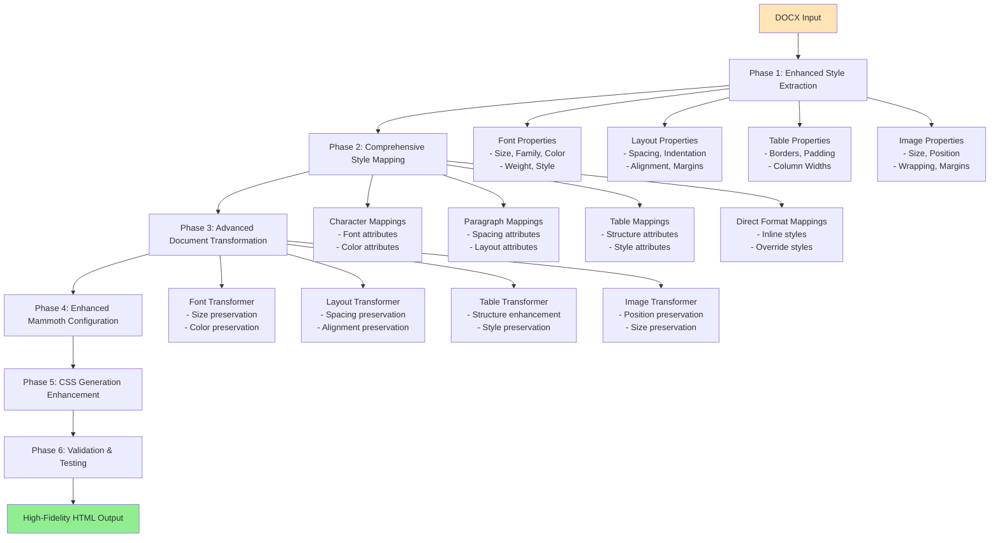

# Mammoth.js Fidelity Enhancement Plan

**Document Version:** 1.0  
**Date:** June 2, 2025  
**Status:** Implementation Ready  
**Objective:** Achieve comprehensive fidelity across fonts, layout, tables, and images in DOCX to HTML conversion

## Executive Summary

The current mammoth.js configuration is significantly limiting the fidelity of HTML output compared to the original DOCX documents. This plan addresses critical gaps in style extraction, mapping, transformation, and mammoth configuration to achieve near-perfect visual fidelity.

## Current State Analysis

### Critical Issues Identified

1. **Limited Style Information Extraction**
   - Missing font sizes, colors, and font families from character styles
   - Missing spacing, indentation, and alignment from paragraph styles
   - Missing table formatting, borders, and cell properties
   - Missing page layout, margins, and document-level formatting

2. **Insufficient Style Mapping**
   - Basic paragraph and character mappings only
   - No font property mappings
   - No color or background mappings
   - No table-specific style mappings
   - No direct formatting preservation

3. **Limited Document Transformation**
   - Only handles bullet point conversion
   - No font size preservation
   - No color preservation
   - No spacing/indentation preservation
   - No table structure enhancement

4. **Basic Mammoth Configuration**
   - Missing critical options like `preserveEmptyParagraphs`
   - Limited image handling
   - No element identification prefixes
   - No custom transformers for specific elements

## Comprehensive Enhancement Plan



## Phase 1: Enhanced Style Extraction

### 1.1 Character Style Enhancement
**File:** [`lib/parsers/style-parser.js`](lib/parsers/style-parser.js)

**Enhancements:**
```javascript
function parseRunningProperties(rPrNode) {
  const props = {};
  
  // Enhanced font extraction
  const fontNode = selectSingleNode("w:rFonts", rPrNode);
  if (fontNode) {
    props.font = {
      ascii: fontNode.getAttribute('w:ascii'),
      hAnsi: fontNode.getAttribute('w:hAnsi'),
      eastAsia: fontNode.getAttribute('w:eastAsia'),
      cs: fontNode.getAttribute('w:cs'),
      // Add font theme references
      asciiTheme: fontNode.getAttribute('w:asciiTheme'),
      hAnsiTheme: fontNode.getAttribute('w:hAnsiTheme')
    };
  }
  
  // Enhanced size extraction with complex script support
  const szNode = selectSingleNode("w:sz", rPrNode);
  const szCsNode = selectSingleNode("w:szCs", rPrNode);
  if (szNode || szCsNode) {
    props.fontSize = {
      ascii: szNode ? (parseInt(szNode.getAttribute('w:val'), 10) / 2) + 'pt' : null,
      cs: szCsNode ? (parseInt(szCsNode.getAttribute('w:val'), 10) / 2) + 'pt' : null
    };
  }
  
  // Enhanced color extraction
  const colorNode = selectSingleNode("w:color", rPrNode);
  if (colorNode) {
    props.color = {
      val: colorNode.getAttribute('w:val'),
      theme: colorNode.getAttribute('w:themeColor'),
      tint: colorNode.getAttribute('w:themeTint'),
      shade: colorNode.getAttribute('w:themeShade')
    };
  }
  
  // Background/highlight extraction
  const highlightNode = selectSingleNode("w:highlight", rPrNode);
  const shdNode = selectSingleNode("w:shd", rPrNode);
  if (highlightNode || shdNode) {
    props.background = {
      highlight: highlightNode ? highlightNode.getAttribute('w:val') : null,
      fill: shdNode ? shdNode.getAttribute('w:fill') : null,
      color: shdNode ? shdNode.getAttribute('w:color') : null
    };
  }
  
  // Text effects
  const effectsNode = selectSingleNode("w:textOutline", rPrNode);
  if (effectsNode) {
    props.textEffects = {
      outline: true,
      outlineColor: effectsNode.getAttribute('w:color'),
      outlineWidth: effectsNode.getAttribute('w:w')
    };
  }
  
  return props;
}
```

### 1.2 Paragraph Style Enhancement
**File:** [`lib/parsers/style-parser.js`](lib/parsers/style-parser.js)

**Enhancements:**
```javascript
function parseEnhancedParagraphProperties(pPrNode) {
  const props = {};
  
  // Enhanced spacing extraction
  const spacingNode = selectSingleNode("w:spacing", pPrNode);
  if (spacingNode) {
    props.spacing = {
      before: spacingNode.getAttribute('w:before'),
      beforeLines: spacingNode.getAttribute('w:beforeLines'),
      after: spacingNode.getAttribute('w:after'),
      afterLines: spacingNode.getAttribute('w:afterLines'),
      line: spacingNode.getAttribute('w:line'),
      lineRule: spacingNode.getAttribute('w:lineRule')
    };
  }
  
  // Enhanced indentation extraction
  const indNode = selectSingleNode("w:ind", pPrNode);
  if (indNode) {
    props.indentation = {
      left: indNode.getAttribute('w:left'),
      leftChars: indNode.getAttribute('w:leftChars'),
      right: indNode.getAttribute('w:right'),
      rightChars: indNode.getAttribute('w:rightChars'),
      firstLine: indNode.getAttribute('w:firstLine'),
      firstLineChars: indNode.getAttribute('w:firstLineChars'),
      hanging: indNode.getAttribute('w:hanging'),
      hangingChars: indNode.getAttribute('w:hangingChars')
    };
  }
  
  // Enhanced alignment extraction
  const jcNode = selectSingleNode("w:jc", pPrNode);
  if (jcNode) {
    props.alignment = jcNode.getAttribute('w:val');
  }
  
  // Page break and keep properties
  const pageBreakNode = selectSingleNode("w:pageBreakBefore", pPrNode);
  const keepNextNode = selectSingleNode("w:keepNext", pPrNode);
  const keepLinesNode = selectSingleNode("w:keepLines", pPrNode);
  
  if (pageBreakNode || keepNextNode || keepLinesNode) {
    props.pageProperties = {
      pageBreakBefore: pageBreakNode !== null,
      keepNext: keepNextNode !== null,
      keepLines: keepLinesNode !== null
    };
  }
  
  return props;
}
```

### 1.3 Table Style Enhancement
**File:** [`lib/parsers/style-parser.js`](lib/parsers/style-parser.js)

**New Function:**
```javascript
function parseTableProperties(tblPrNode) {
  const props = {};
  
  // Table width and alignment
  const tblWNode = selectSingleNode("w:tblW", tblPrNode);
  if (tblWNode) {
    props.width = {
      value: tblWNode.getAttribute('w:w'),
      type: tblWNode.getAttribute('w:type')
    };
  }
  
  // Table alignment
  const jcNode = selectSingleNode("w:jc", tblPrNode);
  if (jcNode) {
    props.alignment = jcNode.getAttribute('w:val');
  }
  
  // Table borders
  const tblBordersNode = selectSingleNode("w:tblBorders", tblPrNode);
  if (tblBordersNode) {
    props.borders = {
      top: extractBorderProperties(selectSingleNode("w:top", tblBordersNode)),
      left: extractBorderProperties(selectSingleNode("w:left", tblBordersNode)),
      bottom: extractBorderProperties(selectSingleNode("w:bottom", tblBordersNode)),
      right: extractBorderProperties(selectSingleNode("w:right", tblBordersNode)),
      insideH: extractBorderProperties(selectSingleNode("w:insideH", tblBordersNode)),
      insideV: extractBorderProperties(selectSingleNode("w:insideV", tblBordersNode))
    };
  }
  
  // Cell margins
  const cellMarNode = selectSingleNode("w:tblCellMar", tblPrNode);
  if (cellMarNode) {
    props.cellMargins = {
      top: extractMarginValue(selectSingleNode("w:top", cellMarNode)),
      left: extractMarginValue(selectSingleNode("w:left", cellMarNode)),
      bottom: extractMarginValue(selectSingleNode("w:bottom", cellMarNode)),
      right: extractMarginValue(selectSingleNode("w:right", cellMarNode))
    };
  }
  
  return props;
}
```

## Phase 2: Comprehensive Style Mapping

### 2.1 Enhanced Character Style Mapping
**File:** [`lib/html/generators/style-mapping.js`](lib/html/generators/style-mapping.js)

**Enhancements:**
```javascript
function createEnhancedCharacterStyleMap(styleInfo) {
  const styleMap = [];
  
  Object.entries(styleInfo.styles?.character || {}).forEach(([id, style]) => {
    const safeClassName = id.toLowerCase().replace(/[^a-z0-9-_]/g, "-");
    let mapping = `r[style-name='${style.name}'] => span.docx-c-${safeClassName}`;
    
    // Add font size attributes
    if (style.fontSize) {
      if (style.fontSize.ascii) {
        mapping += `[data-font-size='${style.fontSize.ascii}']`;
      }
      if (style.fontSize.cs) {
        mapping += `[data-font-size-cs='${style.fontSize.cs}']`;
      }
    }
    
    // Add color attributes
    if (style.color) {
      if (style.color.val && style.color.val !== 'auto') {
        mapping += `[data-color='#${style.color.val}']`;
      }
      if (style.color.theme) {
        mapping += `[data-theme-color='${style.color.theme}']`;
      }
    }
    
    // Add font family attributes
    if (style.font) {
      if (style.font.ascii) {
        mapping += `[data-font-family='${style.font.ascii}']`;
      }
    }
    
    // Add background attributes
    if (style.background) {
      if (style.background.highlight) {
        mapping += `[data-highlight='${style.background.highlight}']`;
      }
      if (style.background.fill) {
        mapping += `[data-background='#${style.background.fill}']`;
      }
    }
    
    styleMap.push(mapping);
  });
  
  return styleMap;
}
```

### 2.2 Enhanced Paragraph Style Mapping
**File:** [`lib/html/generators/style-mapping.js`](lib/html/generators/style-mapping.js)

**Enhancements:**
```javascript
function createEnhancedParagraphStyleMap(styleInfo) {
  const styleMap = [];
  
  Object.entries(styleInfo.styles?.paragraph || {}).forEach(([id, style]) => {
    const safeClassName = id.toLowerCase().replace(/[^a-z0-9-_]/g, "-");
    let mapping = `p[style-name='${style.name}'] => p.docx-p-${safeClassName}`;
    
    // Add spacing attributes
    if (style.spacing) {
      if (style.spacing.before) {
        mapping += `[data-spacing-before='${style.spacing.before}']`;
      }
      if (style.spacing.after) {
        mapping += `[data-spacing-after='${style.spacing.after}']`;
      }
      if (style.spacing.line) {
        mapping += `[data-line-spacing='${style.spacing.line}']`;
      }
    }
    
    // Add indentation attributes
    if (style.indentation) {
      if (style.indentation.left) {
        mapping += `[data-indent-left='${style.indentation.left}']`;
      }
      if (style.indentation.right) {
        mapping += `[data-indent-right='${style.indentation.right}']`;
      }
      if (style.indentation.firstLine) {
        mapping += `[data-indent-first='${style.indentation.firstLine}']`;
      }
      if (style.indentation.hanging) {
        mapping += `[data-indent-hanging='${style.indentation.hanging}']`;
      }
    }
    
    // Add alignment attributes
    if (style.alignment) {
      mapping += `[data-alignment='${style.alignment}']`;
    }
    
    styleMap.push(mapping);
  });
  
  return styleMap;
}
```

### 2.3 Table Style Mapping
**File:** [`lib/html/generators/style-mapping.js`](lib/html/generators/style-mapping.js)

**New Function:**
```javascript
function createTableStyleMap(styleInfo) {
  const styleMap = [];
  
  // Table style mappings
  Object.entries(styleInfo.styles?.table || {}).forEach(([id, style]) => {
    const safeClassName = id.toLowerCase().replace(/[^a-z0-9-_]/g, "-");
    let mapping = `table[style-name='${style.name}'] => table.docx-table-${safeClassName}`;
    
    // Add table width attributes
    if (style.width) {
      mapping += `[data-width='${style.width.value}'][data-width-type='${style.width.type}']`;
    }
    
    // Add alignment attributes
    if (style.alignment) {
      mapping += `[data-table-alignment='${style.alignment}']`;
    }
    
    styleMap.push(mapping);
  });
  
  // Cell style mappings
  styleMap.push("tc => td[data-cell='true']");
  styleMap.push("tr => tr[data-row='true']");
  
  return styleMap;
}
```

## Phase 3: Advanced Document Transformation

### 3.1 Enhanced Document Transformer
**File:** [`lib/html/generators/style-mapping.js`](lib/html/generators/style-mapping.js)

**Complete Rewrite:**
```javascript
function createEnhancedDocumentTransformer(styleInfo) {
  return function (element) {
    // Font size transformation
    if (element.type === "run" && element.styleName) {
      const characterStyle = findStyleByName(styleInfo.styles?.character, element.styleName);
      if (characterStyle?.fontSize) {
        element.fontSize = characterStyle.fontSize;
      }
      if (characterStyle?.color) {
        element.color = characterStyle.color;
      }
      if (characterStyle?.font) {
        element.fontFamily = characterStyle.font;
      }
    }
    
    // Paragraph spacing transformation
    if (element.type === "paragraph" && element.styleName) {
      const paragraphStyle = findStyleByName(styleInfo.styles?.paragraph, element.styleName);
      if (paragraphStyle?.spacing) {
        element.spacing = paragraphStyle.spacing;
      }
      if (paragraphStyle?.indentation) {
        element.indentation = paragraphStyle.indentation;
      }
      if (paragraphStyle?.alignment) {
        element.alignment = paragraphStyle.alignment;
      }
    }
    
    // Table transformation
    if (element.type === "table" && element.styleName) {
      const tableStyle = findStyleByName(styleInfo.styles?.table, element.styleName);
      if (tableStyle) {
        element.tableProperties = tableStyle;
      }
    }
    
    // Bullet point transformation (existing)
    if (element.type === "paragraph") {
      const numberingInfo = getNumberingInfo(element, styleInfo);
      if (numberingInfo && numberingInfo.format === 'bullet') {
        return {
          ...element,
          type: "listItem",
          listType: "unordered",
          level: numberingInfo.level || 0,
          bulletChar: numberingInfo.bulletChar || '•'
        };
      }
    }
    
    return element;
  };
}
```

## Phase 4: Enhanced Mammoth Configuration

### 4.1 Complete Mammoth Configuration Overhaul
**File:** [`lib/html/html-generator.js`](lib/html/html-generator.js)

**Enhanced Configuration:**
```javascript
async function convertToStyledHtml(docxPath, styleInfo) {
  try {
    const enhancedStyleMap = [
      ...createEnhancedCharacterStyleMap(styleInfo),
      ...createEnhancedParagraphStyleMap(styleInfo),
      ...createTableStyleMap(styleInfo),
      ...createDirectFormattingMap(styleInfo)
    ];
    
    const enhancedTransformer = createEnhancedDocumentTransformer(styleInfo);
    const enhancedImageOptions = createEnhancedImageOptions();
    
    const result = await mammoth.convertToHtml({
      path: docxPath,
      styleMap: enhancedStyleMap,
      transformDocument: enhancedTransformer,
      includeDefaultStyleMap: true,
      preserveEmptyParagraphs: true,
      ignoreEmptyParagraphs: false,
      idPrefix: "docx-",
      convertImage: enhancedImageOptions.convertImage,
      // Additional options for better fidelity
      includeEmbeddedStyleMap: true,
      transformDocument: mammoth.transforms.paragraph(function(element) {
        // Preserve paragraph properties
        if (element.styleName) {
          element.attributes = element.attributes || {};
          element.attributes["data-style-name"] = element.styleName;
        }
        return element;
      }),
      transformDocument: mammoth.transforms.run(function(element) {
        // Preserve run properties
        if (element.styleName) {
          element.attributes = element.attributes || {};
          element.attributes["data-style-name"] = element.styleName;
        }
        return element;
      })
    });
    
    console.log('Enhanced mammoth conversion completed');
    console.log(`Style mappings applied: ${enhancedStyleMap.length}`);
    
    return result;
  } catch (error) {
    console.error("Error in enhanced convertToStyledHtml:", error);
    throw error;
  }
}
```

## Phase 5: CSS Generation Enhancement

### 5.1 Enhanced Character Styles CSS
**File:** [`lib/css/generators/character-styles.js`](lib/css/generators/character-styles.js)

**Complete Enhancement:**
```javascript
function generateEnhancedCharacterStyles(styleInfo) {
  let css = "\n/* Enhanced Character Styles */\n";
  
  Object.entries(styleInfo.styles?.character || {}).forEach(([id, style]) => {
    const className = `docx-c-${id.toLowerCase().replace(/[^a-zA-Z0-9-_]/g, "-")}`;
    
    css += `
.${className} {
  ${generateFontProperties(style)}
  ${generateColorProperties(style)}
  ${generateBackgroundProperties(style)}
  ${generateTextEffectProperties(style)}
}
`;
  });
  
  // Data attribute selectors for dynamic styling
  css += generateDataAttributeStyles();
  
  return css;
}

function generateFontProperties(style) {
  let props = "";
  
  if (style.font?.ascii) {
    props += `font-family: "${style.font.ascii}", sans-serif;\n  `;
  }
  
  if (style.fontSize?.ascii) {
    props += `font-size: ${style.fontSize.ascii};\n  `;
  }
  
  if (style.bold) {
    props += `font-weight: bold;\n  `;
  }
  
  if (style.italic) {
    props += `font-style: italic;\n  `;
  }
  
  return props;
}

function generateColorProperties(style) {
  let props = "";
  
  if (style.color?.val && style.color.val !== 'auto') {
    props += `color: #${style.color.val};\n  `;
  }
  
  return props;
}

function generateDataAttributeStyles() {
  return `
/* Data attribute styles for dynamic formatting */
[data-font-size] { font-size: attr(data-font-size); }
[data-color] { color: attr(data-color); }
[data-font-family] { font-family: attr(data-font-family), sans-serif; }
[data-highlight="yellow"] { background-color: yellow; }
[data-highlight="green"] { background-color: lightgreen; }
[data-highlight="cyan"] { background-color: cyan; }
[data-highlight="magenta"] { background-color: magenta; }
[data-highlight="blue"] { background-color: lightblue; }
[data-highlight="red"] { background-color: lightcoral; }
[data-highlight="darkBlue"] { background-color: darkblue; color: white; }
[data-highlight="darkCyan"] { background-color: darkcyan; color: white; }
[data-highlight="darkGreen"] { background-color: darkgreen; color: white; }
[data-highlight="darkMagenta"] { background-color: darkmagenta; color: white; }
[data-highlight="darkRed"] { background-color: darkred; color: white; }
[data-highlight="darkYellow"] { background-color: olive; color: white; }
[data-highlight="darkGray"] { background-color: darkgray; }
[data-highlight="lightGray"] { background-color: lightgray; }
[data-highlight="black"] { background-color: black; color: white; }
`;
}
```

### 5.2 Enhanced Paragraph Styles CSS
**File:** [`lib/css/generators/paragraph-styles.js`](lib/css/generators/paragraph-styles.js)

**Complete Enhancement:**
```javascript
function generateEnhancedParagraphStyles(styleInfo) {
  let css = "\n/* Enhanced Paragraph Styles */\n";
  
  Object.entries(styleInfo.styles?.paragraph || {}).forEach(([id, style]) => {
    const className = `docx-p-${id.toLowerCase().replace(/[^a-zA-Z0-9-_]/g, "-")}`;
    
    css += `
.${className} {
  ${generateSpacingProperties(style)}
  ${generateIndentationProperties(style)}
  ${generateAlignmentProperties(style)}
  ${generateBorderProperties(style)}
}
`;
  });
  
  // Data attribute selectors for spacing
  css += generateSpacingDataAttributes();
  
  return css;
}

function generateSpacingProperties(style) {
  let props = "";
  
  if (style.spacing?.before) {
    const beforePt = convertTwipToPt(style.spacing.before);
    props += `margin-top: ${beforePt}pt;\n  `;
  }
  
  if (style.spacing?.after) {
    const afterPt = convertTwipToPt(style.spacing.after);
    props += `margin-bottom: ${afterPt}pt;\n  `;
  }
  
  if (style.spacing?.line && style.spacing?.lineRule) {
    if (style.spacing.lineRule === 'auto') {
      const lineHeight = parseInt(style.spacing.line) / 240; // Convert to multiplier
      props += `line-height: ${lineHeight};\n  `;
    } else if (style.spacing.lineRule === 'exact') {
      const lineHeightPt = convertTwipToPt(style.spacing.line);
      props += `line-height: ${lineHeightPt}pt;\n  `;
    }
  }
  
  return props;
}

function generateIndentationProperties(style) {
  let props = "";
  
  if (style.indentation?.left) {
    const leftPt = convertTwipToPt(style.indentation.left);
    props += `margin-left: ${leftPt}pt;\n  `;
  }
  
  if (style.indentation?.right) {
    const rightPt = convertTwipToPt(style.indentation.right);
    props += `margin-right: ${rightPt}pt;\n  `;
  }
  
  if (style.indentation?.firstLine) {
    const firstLinePt = convertTwipToPt(style.indentation.firstLine);
    props += `text-indent: ${firstLinePt}pt;\n  `;
  } else if (style.indentation?.hanging) {
    const hangingPt = convertTwipToPt(style.indentation.hanging);
    props += `text-indent: -${hangingPt}pt;\n  `;
    props += `padding-left: ${hangingPt}pt;\n  `;
  }
  
  return props;
}

function generateSpacingDataAttributes() {
  return `
/* Data attribute styles for dynamic spacing */
[data-spacing-before] { margin-top: attr(data-spacing-before); }
[data-spacing-after] { margin-bottom: attr(data-spacing-after); }
[data-indent-left] { margin-left: attr(data-indent-left); }
[data-indent-right] { margin-right: attr(data-indent-right); }
[data-indent-first] { text-indent: attr(data-indent-first); }
[data-alignment="left"] { text-align: left; }
[data-alignment="center"] { text-align: center; }
[data-alignment="right"] { text-align: right; }
[data-alignment="justify"] { text-align: justify; }
`;
}
```

## Phase 6: Validation and Testing

### 6.1 Comprehensive Test Suite
**File:** [`test-mammoth-fidelity.js`](test-mammoth-fidelity.js)

**New Test Script:**
```javascript
#!/usr/bin/env node

const fs = require('fs');
const path = require('path');
const { extractAndApplyStyles } = require('./lib/html/html-generator');

/**
 * Comprehensive fidelity testing for mammoth enhancements
 */
async function testMammothFidelity() {
  console.log('=== Mammoth Fidelity Test Suite ===\n');
  
  const testCases = [
    {
      name: 'Font Fidelity Test',
      description: 'Tests font sizes, families, and colors',
      validator: validateFontFidelity
    },
    {
      name: 'Layout Fidelity Test', 
      description: 'Tests spacing, indentation, and alignment',
      validator: validateLayoutFidelity
    },
    {
      name: 'Table Fidelity Test',
      description: 'Tests table structure and formatting',
      validator: validateTableFidelity
    },
    {
      name: 'Image Fidelity Test',
      description: 'Tests image positioning and sizing',
      validator: validateImageFidelity
    }
  ];
  
  // Look for test DOCX files
  const testFiles = fs.readdirSync('.')
    .filter(file => file.toLowerCase().endsWith('.docx'))
    .slice(0, 3); // Test with first 3 DOCX files found
  
  if (testFiles.length === 0) {
    console.log('No DOCX files found for testing.');
    console.log('Please place test DOCX files in the current directory.');
    return;
  }
  
  for (const docxFile of testFiles) {
    console.log(`\nTesting with: ${docxFile}`);
    console.log('='.repeat(50));
    
    try {
      const result = await extractAndApplyStyles(docxFile);
      
      // Run all test cases
      for (const testCase of testCases) {
        console.log(`\n${testCase.name}:`);
        const passed = testCase.validator(result.html, result.styles);
        console.log(`  Status: ${passed ? '✅ PASSED' : '❌ FAILED'}`);
      }
      
      // Save detailed test output
      const outputDir = 'fidelity-test-output';
      if (!fs.existsSync(outputDir)) {
        fs.mkdirSync(outputDir);
      }
      
      const baseName = path.basename(docxFile, '.docx');
      fs.writeFileSync(path.join(outputDir, `${baseName}-fidelity-test.html`), result.html);
      fs.writeFileSync(path.join(outputDir, `${baseName}-fidelity-test.css`), result.styles);
      
    } catch (error) {
      console.error(`Error testing ${docxFile}:`, error.message);
    }
  }
}

function validateFontFidelity(html, css) {
  // Check for font-size attributes and CSS rules
  const fontSizeMatches = html.match(/data-font-size/g) || [];
  const cssFontSizes = css.match(/font-size:\s*[^;]+/g) || [];
  
  console.log(`    Font size attributes: ${fontSizeMatches.length}`);
  console.log(`    CSS font-size rules: ${cssFontSizes.length}`);
  
  return fontSizeMatches.length > 0 || cssFontSizes.length > 0;
}

function validateLayoutFidelity(html, css) {
  // Check for spacing and indentation
  const spacingMatches = html.match(/data-spacing-|data-indent-/g) || [];
