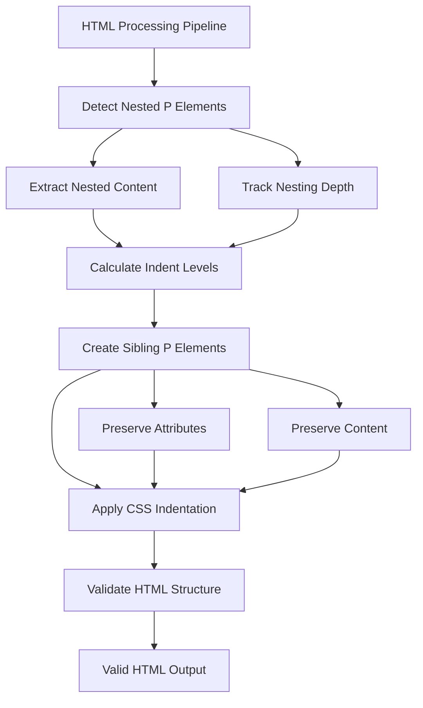

# Nested Paragraph Fix Implementation Plan

**Document Version:** 1.0  
**Date:** June 2, 2025  
**Status:** Implementation Ready  
**Priority:** High - HTML Validity Issue  

## Problem Statement

The doc2web tool currently generates invalid HTML with nested `<p>` elements, which violates HTML standards. Browsers auto-correct this invalid structure, potentially breaking the intended layout and styling.

### Example of Current Invalid Structure
```html
<p data-num-id="1" data-abstract-num="21" data-num-level="0">
  1. Consent Agenda:
  <p data-num-id="1" data-abstract-num="21" data-num-level="1">
    a. Approval of Board Meeting Minutes
    <p>
      Rationale for Resolution 2016.02.03.03
      <p data-num-id="1" data-abstract-num="21" data-num-level="1">
        b. RSSAC Co-Chair Appointments
        <!-- More nested paragraphs... -->
      </p>
    </p>
  </p>
</p>
```

### Target Valid Structure
```html
<p data-num-id="1" data-abstract-num="21" data-num-level="0" data-indent-level="0">
  1. Consent Agenda:
</p>
<p data-num-id="1" data-abstract-num="21" data-num-level="1" data-indent-level="1">
  a. Approval of Board Meeting Minutes
</p>
<p data-indent-level="2">
  Rationale for Resolution 2016.02.03.03
</p>
<p data-num-id="1" data-abstract-num="21" data-num-level="1" data-indent-level="1">
  b. RSSAC Co-Chair Appointments
</p>
```

## Solution Overview

Implement a simple flattening approach that converts nested `<p>` elements to sibling elements with CSS-based indentation to maintain visual hierarchy.

## Implementation Strategy



## Technical Implementation

### Phase 1: HTML Structure Analysis and Flattening

#### 1.1 Create Paragraph Flattening Function
**File:** `lib/html/generators/html-processing.js`

```javascript
/**
 * Flatten nested paragraph elements to sibling elements with proper indentation
 * @param {Document} document - HTML document
 */
function flattenNestedParagraphs(document) {
  const nestedParagraphs = document.querySelectorAll('p p');
  
  if (nestedParagraphs.length === 0) {
    return; // No nested paragraphs found
  }
  
  console.log(`Flattening ${nestedParagraphs.length} nested paragraph elements`);
  
  // Process from deepest nesting first to avoid DOM manipulation issues
  const allParagraphs = Array.from(document.querySelectorAll('p'));
  const rootParagraphs = allParagraphs.filter(p => !p.closest('p'));
  
  rootParagraphs.forEach(rootP => {
    flattenParagraphHierarchy(rootP, 0);
  });
}

/**
 * Recursively flatten a paragraph hierarchy
 * @param {Element} paragraph - Root paragraph element
 * @param {number} baseIndentLevel - Base indentation level
 */
function flattenParagraphHierarchy(paragraph, baseIndentLevel) {
  const nestedParagraphs = Array.from(paragraph.querySelectorAll(':scope > p'));
  
  if (nestedParagraphs.length === 0) {
    // Set indent level for leaf paragraph
    paragraph.setAttribute('data-indent-level', baseIndentLevel.toString());
    return;
  }
  
  // Set indent level for current paragraph
  paragraph.setAttribute('data-indent-level', baseIndentLevel.toString());
  
  // Extract nested paragraphs and insert as siblings
  const parentElement = paragraph.parentElement;
  const insertionPoint = paragraph.nextSibling;
  
  nestedParagraphs.forEach(nestedP => {
    // Remove from current location
    nestedP.remove();
    
    // Recursively flatten nested content
    flattenParagraphHierarchy(nestedP, baseIndentLevel + 1);
    
    // Insert as sibling after current paragraph
    if (insertionPoint) {
      parentElement.insertBefore(nestedP, insertionPoint);
    } else {
      parentElement.appendChild(nestedP);
    }
  });
}
```

#### 1.2 Integration Point
Add the flattening function to the main HTML processing pipeline:

```javascript
// In applyStylesAndProcessHtml function, after content processing
// Add this after line ~175 (after content preservation validation)

// Flatten nested paragraphs to create valid HTML structure
flattenNestedParagraphs(document);

// Validate HTML structure
validateHtmlStructure(document);
```

#### 1.3 HTML Structure Validator
```javascript
/**
 * Validate HTML structure for common issues
 * @param {Document} document - HTML document
 */
function validateHtmlStructure(document) {
  const nestedParagraphs = document.querySelectorAll('p p');
  
  if (nestedParagraphs.length > 0) {
    console.warn(`Warning: ${nestedParagraphs.length} nested paragraph elements still exist after flattening`);
    return false;
  }
  
  console.log('HTML structure validation passed - no nested paragraphs found');
  return true;
}
```

### Phase 2: CSS Indentation System

#### 2.1 Update Paragraph Styles
**File:** `lib/css/generators/paragraph-styles.js`

Add indentation styles based on `data-indent-level` attribute:

```javascript
/**
 * Generate indentation styles for flattened paragraphs
 */
function generateIndentationStyles() {
  const maxIndentLevels = 10; // Support up to 10 levels of indentation
  const indentSize = 20; // 20px per level
  
  let styles = '';
  
  for (let level = 0; level <= maxIndentLevels; level++) {
    const marginLeft = level * indentSize;
    styles += `
/* Indentation level ${level} */
p[data-indent-level="${level}"] {
  margin-left: ${marginLeft}px;
  position: relative;
}

/* Ensure proper spacing between indented paragraphs */
p[data-indent-level="${level}"] + p[data-indent-level="${level}"] {
  margin-top: 0.5em;
}

/* Reduce spacing for consecutive paragraphs at different levels */
p[data-indent-level="${level}"] + p[data-indent-level="${level + 1}"] {
  margin-top: 0.25em;
}
`;
  }
  
  return styles;
}
```

#### 2.2 Integration with CSS Generator
Update the main CSS generation to include indentation styles:

```javascript
// In generateParagraphStyles function
const indentationStyles = generateIndentationStyles();
styles += indentationStyles;
```

### Phase 3: Preserve Existing Functionality

#### 3.1 Maintain Data Attributes
Ensure all existing data attributes are preserved during flattening:
- `data-num-id`
- `data-abstract-num`
- `data-num-level`
- `data-format`
- `data-section-id`
- Language attributes (`lang`)

#### 3.2 Preserve CSS Classes
Maintain existing CSS classes and styling:
- Numbering classes
- Style-specific classes
- Accessibility classes

#### 3.3 Preserve Content Integrity
Ensure no content is lost during the flattening process:
- Text content
- Inline formatting (bold, italic, etc.)
- Links and other inline elements

## Testing Strategy

### 3.1 HTML Validation
- Run W3C HTML validator on output
- Ensure no nested `<p>` elements exist
- Verify semantic correctness

### 3.2 Visual Regression Testing
- Compare before/after visual output
- Ensure indentation hierarchy is maintained
- Test with various document types

### 3.3 Content Integrity Testing
- Verify all content is preserved
- Check that data attributes are maintained
- Ensure section IDs and navigation work

## Files to Modify

### Primary Changes
1. **`lib/html/generators/html-processing.js`**
   - Add `flattenNestedParagraphs()` function
   - Add `flattenParagraphHierarchy()` function
   - Add `validateHtmlStructure()` function
   - Integrate flattening into processing pipeline

2. **`lib/css/generators/paragraph-styles.js`**
   - Add `generateIndentationStyles()` function
   - Update main paragraph style generation

### Secondary Changes
3. **`lib/html/generators/html-formatting.js`** (if needed)
   - Update formatting logic to handle flattened structure

## Success Criteria

1. **HTML Validity**: Zero nested `<p>` elements in output
2. **Visual Fidelity**: Maintains original document indentation and hierarchy
3. **Content Preservation**: No loss of text, attributes, or formatting
4. **Performance**: Minimal impact on processing time
5. **Backward Compatibility**: Existing functionality preserved

## Risk Mitigation

1. **Backup Strategy**: Keep original processing logic as fallback
2. **Incremental Testing**: Test with sample documents before full deployment
3. **Validation Checks**: Add comprehensive HTML structure validation
4. **Error Handling**: Graceful degradation if flattening fails

## Implementation Timeline

1. **Phase 1** (Day 1): Implement flattening logic and validation
2. **Phase 2** (Day 1): Update CSS indentation system
3. **Phase 3** (Day 2): Testing and validation
4. **Phase 4** (Day 2): Documentation and deployment

## Expected Outcome

After implementation, the doc2web tool will generate valid HTML with:
- No nested `<p>` elements
- Proper visual hierarchy maintained through CSS indentation
- All content and attributes preserved
- Improved accessibility and browser compatibility
- Valid HTML that passes W3C validation

This fix addresses a fundamental HTML validity issue while maintaining the visual fidelity and functionality of the converted documents.
