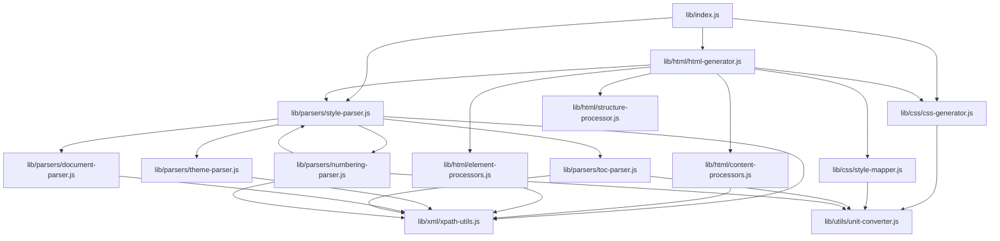

# Refactoring Plan for style-extractor.js and docx-style-parser.js

## 1. Overview

This plan outlines the refactoring of `style-extractor.js` and `docx-style-parser.js` into a more modular and maintainable structure. The refactoring will:

1. Split the code into logical function groups
2. Consolidate related functionality to avoid too many small files
3. Add comprehensive comments to explain complex algorithms
4. Maintain backward compatibility with existing code

## 2. Directory Structure

```
lib/
├── index.js                    # Main entry point that re-exports public API
├── xml/
│   └── xpath-utils.js          # XML and XPath utilities
├── parsers/
│   ├── style-parser.js         # Style parsing functions
│   ├── toc-parser.js           # TOC parsing functions
│   ├── numbering-parser.js     # Numbering parsing functions
│   ├── theme-parser.js         # Theme parsing functions
│   └── document-parser.js      # Document structure analysis
├── html/
│   ├── html-generator.js       # HTML generation functions
│   ├── structure-processor.js  # HTML structure handling
│   ├── content-processors.js   # Heading, TOC, and list processors
│   └── element-processors.js   # Table, image, and language processors
├── css/
│   ├── css-generator.js        # CSS generation functions
│   └── style-mapper.js         # Style mapping functions
└── utils/
    └── unit-converter.js       # Unit conversion utilities
```

## 3. File Contents and Function Distribution

### lib/index.js
Main entry point that re-exports the public API to maintain backward compatibility.

**Functions:**
- Re-exports `extractAndApplyStyles` from html/html-generator.js
- Re-exports `parseDocxStyles` and `generateCssFromStyleInfo` from parsers/style-parser.js and css/css-generator.js

```javascript
// Re-export the public API to maintain backward compatibility
const { extractAndApplyStyles } = require('./html/html-generator');
const { parseDocxStyles } = require('./parsers/style-parser');
const { generateCssFromStyleInfo } = require('./css/css-generator');

module.exports = {
  extractAndApplyStyles,
  parseDocxStyles,
  generateCssFromStyleInfo
};
```

### lib/xml/xpath-utils.js
XML and XPath utilities for working with DOCX XML structure.

**Functions:**
- `createXPathSelector` - Create an XPath selector with namespaces registered
- `selectNodes` - Select nodes using XPath with namespaces
- `selectSingleNode` - Select a single node using XPath with namespaces
- `NAMESPACES` constant - Define XML namespaces used in DOCX files

### lib/parsers/style-parser.js
Core style parsing functions for extracting style information from DOCX files.

**Functions:**
- `parseDocxStyles` - Parse a DOCX file to extract detailed style information
- `parseStyles` - Parse styles.xml to extract style definitions
- `parseStyleNode` - Parse individual style node
- `parseRunningProperties` - Parse running properties (text formatting)
- `parseParagraphProperties` - Parse paragraph properties
- `parseBorders` - Parse border information

### lib/parsers/toc-parser.js
Functions for parsing Table of Contents styles from DOCX files.

**Functions:**
- `parseTocStyles` - Enhanced TOC parsing to better capture leader lines and formatting
- `getLeaderChar` - Get leader character based on leader type

### lib/parsers/numbering-parser.js
Functions for parsing numbering definitions from DOCX files.

**Functions:**
- `parseNumberingDefinitions` - Enhanced numbering definition parsing to capture more details
- `getCSSCounterFormat` - Get CSS counter format from Word format name

### lib/parsers/theme-parser.js
Functions for parsing theme information from DOCX files.

**Functions:**
- `parseTheme` - Parse theme information
- `getColorValue` - Get color value from theme color node

### lib/parsers/document-parser.js
Functions for analyzing document structure and parsing document settings.

**Functions:**
- `analyzeDocumentStructure` - Enhanced document structure analysis to capture more details
- `parseDocumentDefaults` - Parse document defaults
- `parseSettings` - Parse document settings
- `getDefaultStyleInfo` - Get default style information if parsing fails

### lib/html/html-generator.js
Main functions for generating HTML from DOCX content with styles.

**Functions:**
- `extractAndApplyStyles` - Extract and apply styles from a DOCX document to HTML
- `convertToStyledHtml` - Convert DOCX to HTML while preserving style information
- `applyStylesToHtml` - Apply generated CSS to HTML

### lib/html/structure-processor.js
Functions for handling basic HTML structure.

**Functions:**
- `ensureHtmlStructure` - Ensure HTML has proper structure (html, head, body)
- `addDocumentMetadata` - Add document metadata based on style information

### lib/html/content-processors.js
Consolidated functions for processing document content elements (headings, TOC, lists).

**Functions:**
- `processHeadings` - Enhanced heading processing with better numbering
- `processTOC` - Enhanced TOC processing for better structure and styling
- `processNestedNumberedParagraphs` - Enhanced numbered paragraph processing for better hierarchical structure
- `identifyListPatterns` - Identify list patterns in the document
- `isSpecialParagraph` - Check if a paragraph is a special type based on patterns
- `processSpecialParagraphs` - Process special paragraph types based on document analysis

### lib/html/element-processors.js
Consolidated functions for processing HTML elements (tables, images, language elements).

**Functions:**
- `processTables` - Process tables for better styling
- `processImages` - Process images for better styling
- `processLanguageElements` - Process language-specific elements

### lib/css/css-generator.js
Functions for generating CSS from extracted style information.

**Functions:**
- `generateCssFromStyleInfo` - Generate CSS from extracted style information with better TOC and list handling
- `getCSSCounterContent` - Get CSS counter content for numbering
- `getFontFamily` - Get font family based on style and theme
- `getBorderStyle` - Get border style

### lib/css/style-mapper.js
Functions for mapping DOCX styles to CSS styles.

**Functions:**
- `createStyleMap` - Create a custom style map based on extracted styles
- `createDocumentTransformer` - Create document transformer function for style preservation

### lib/utils/unit-converter.js
Utility functions for converting units and handling borders.

**Functions:**
- `convertTwipToPt` - Convert twip value to points
- `convertBorderSizeToPt` - Convert border size to point value
- `getBorderTypeValue` - Get CSS border style from Word border value

## 4. Implementation Steps

1. **Create Directory Structure**
   - Create the `lib` directory and all subdirectories

2. **Create Empty Files**
   - Create all the files listed in the structure

3. **Move Functions**
   - Extract functions from the original files and place them in the appropriate new files
   - Add comprehensive comments to explain complex algorithms
   - Ensure proper imports/requires between files

4. **Create Index File**
   - Create the main index.js file that re-exports the public API

5. **Update README.md**
   - Update the README.md to reflect the new structure
   - Add information about the refactoring

6. **Test**
   - Test the refactored code to ensure it works as expected

## 5. Module Dependencies Diagram



## 6. Detailed Comments for Complex Functions

Special attention will be given to adding comprehensive comments to the following complex functions:

1. **processTOC** - Explain the TOC structure processing and leader line handling
2. **processNestedNumberedParagraphs** - Document the hierarchical list structure processing
3. **identifyListPatterns** - Explain the pattern detection algorithm
4. **parseNumberingDefinitions** - Detail the numbering definition extraction
5. **generateCssFromStyleInfo** - Explain the CSS generation process

Example comment structure for complex functions:

```javascript
/**
 * Process Table of Contents for better structure and styling
 * 
 * This function performs several operations:
 * 1. Identifies TOC entries based on class names or content patterns
 * 2. Creates a container for TOC entries if not already present
 * 3. Processes each TOC entry to extract:
 *    - Text content
 *    - Page numbers
 *    - Hierarchical level
 * 4. Structures the TOC with proper HTML elements:
 *    - Adds span elements for text, dots, and page numbers
 *    - Sets appropriate classes for styling
 *    - Maintains hierarchical structure
 * 
 * The function handles various TOC formats including:
 * - Word-generated TOCs with leader lines
 * - Custom TOCs with different formatting
 * - TOCs with or without explicit styling
 * 
 * @param {Document} document - DOM document
 * @param {Object} styleInfo - Style information
 */
```

## 7. README.md Updates

The README.md will be updated to include information about the new structure:

```markdown
## Project Structure

The codebase has been refactored for better organization and maintainability:

```bash
lib/
├── index.js                    # Main entry point
├── xml/                        # XML parsing utilities
├── parsers/                    # DOCX parsing modules
├── html/                       # HTML processing modules
├── css/                        # CSS generation modules
└── utils/                      # Utility functions
```

This modular structure makes the code easier to maintain and extend.
```

## 8. Backward Compatibility

The refactoring will maintain backward compatibility by:

1. Preserving the original public API through the index.js file
2. Ensuring all exported functions maintain their original signatures
3. Keeping the same behavior for all functions

## 9. Benefits of This Approach

1. **Improved Maintainability**
   - Each file has a clear, focused responsibility
   - Smaller files are easier to understand and modify

2. **Better Organization**
   - Related functions are grouped together
   - Clear separation of concerns

3. **Enhanced Documentation**
   - Comprehensive comments explain complex algorithms
   - Better code organization makes the codebase self-documenting

4. **Balanced Structure**
   - Avoids too many small files while maintaining logical separation
   - Related functionality is consolidated appropriately

5. **Simplified TOC/List Processing**
   - Complex TOC and list processing functions are isolated in dedicated files
   - Easier to understand and maintain these complex parts